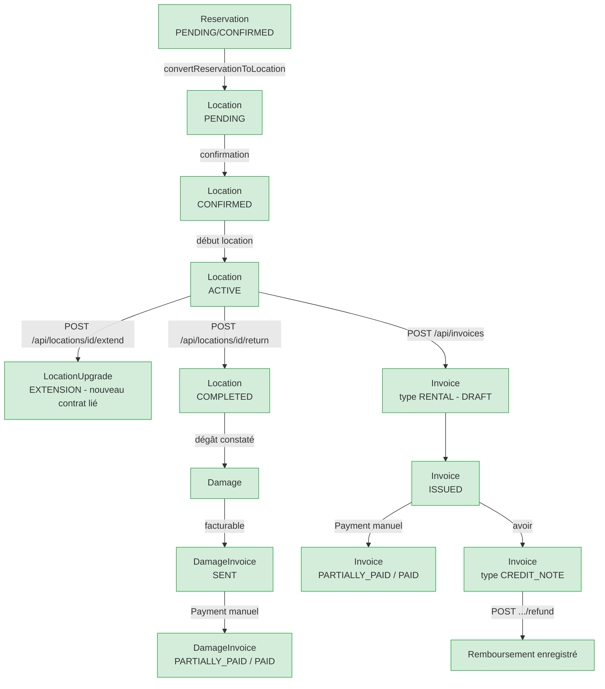

# DEV_HANDOFF_REPORT.md — Rapport de passation technique

Document destiné à un développeur externe rejoignant XRent Manager. Produit par audit en lecture seule du dépôt réel (code, tests, migrations, configuration) — chaque affirmation marquée « vérifié » a été confirmée directement dans le code ou les tests au moment de la rédaction, pas seulement lue dans une documentation.

**Commit de référence** : `ffa00cc19beeb9f6043d8412150869d0c0297031` (« docs: reconcile project documentation ») = `HEAD` = `origin/main` au moment de cet audit.
**Tag de sauvegarde local** : `pre-collaboration-2026-09-18` (annoté, non poussé) — voir section L pour la procédure de rollback.
**Sauvegarde complète locale** : `~/xrent-manager-backups/2026-09-18-pre-collaboration/` (miroir Git + archive du projet + dump `xrent_test`, restauration déjà vérifiée) — chemin local uniquement, hors du dépôt, non partagé automatiquement.
**Date de rédaction** : 2026-09-18.

**Convention utilisée dans tout ce document** pour qualifier une affirmation :
- **[code]** = confirmé en lisant le fichier/la ligne citée au moment de cet audit.
- **[test]** = confirmé en lisant un fichier de test et en comptant ses assertions ; « exécuté » précise que la commande a été relancée pendant cet audit, sinon il s'agit d'un résultat déjà documenté dans TESTREPORT.md (cité comme tel, non rejoué).
- **[doc]** = affirmation reprise d'un document existant, non revérifiée indépendamment dans le code pour ce point précis.
- **[non vérifié]** = affirmation plausible mais non confirmée par cet audit — à vérifier avant de s'y fier.

---

## A. Présentation générale

**Objectif** : XRent Manager est un SaaS de gestion de location de véhicules — permet à des sociétés de location de gérer, par organisation (tenant) et par agence : véhicules, réservations, contrats de location, clients, facturation, paiements, caisse, maintenance, transferts de véhicules, alertes, audit **[doc, README.md/CLAUDE.md]**.

**Périmètre métier** : multi-tenant (isolation stricte entre organisations clientes) et multi-agence (plusieurs points de location par tenant) dès la conception **[code, colonne `tenantId` présente sur la quasi-totalité des 37 modèles Prisma, vérifiée]**.

**Utilisateurs et rôles** : deux rôles applicatifs — `ADMIN` et `MEMBER` **[code, `prisma/schema.prisma` `User.role`]** — complétés par un système de permissions granulaires (`PermissionGroup`/`GroupPermission`/`UserPermission`, fonction `can()` dans `src/lib/permissions.ts`) **[code]**. `ADMIN` court-circuite systématiquement `can()` (accès total à son propre tenant) **[code, `src/lib/permissions.ts`, confirmé par `src/__tests__/audit-deletion.test.ts` 18 tests]**. Un mécanisme **distinct et non interchangeable** existe : le Super Admin plateforme (`isSuperAdminEmail()`, variable `SUPER_ADMIN_EMAILS`), dont l'unique capacité réelle est `POST /api/tenants` (création d'un nouveau tenant) — jamais un accès dashboard général **[code, `src/app/api/tenants/route.ts:93-100`, vérifié]**.

**Volontairement hors périmètre à ce jour** (décisions explicites, pas des oublis) : rôle « superadmin » transverse à tous les tenants (explicitement écarté) ; auto-inscription publique (retirée, remplacée par la création de tenant réservée Super Admin) ; paiement direct d'un dégât sans facture (retiré, remplacé par `DamageInvoice`) ; intégration de paiement en ligne (Stripe/PayPal — paiements toujours enregistrés manuellement, aucune donnée de carte stockée) **[code + doc, SECURITY.md]**.

**État général du projet** : très avancé fonctionnellement (166 commits, 39 migrations, 95 routes API, 68 fichiers de test), **aucun environnement de production n'existe à ce jour** — aucun hébergeur choisi, aucune sauvegarde automatisée en conditions réelles, aucun monitoring **[doc, HANDOFF.md §0, confirmé par absence de toute route `/api/health` — recherche exhaustive]**.

**Version de référence** : `package.json` déclare `"version": "0.1.0"` **[code]**. Le tag Git `v0.1.0` existe déjà (préexistant, indépendant du tag de sauvegarde de cette mission) **[code, `git tag -l`]**.

---

## B. Technologies réellement utilisées

Versions lues directement dans `package.json` **[code]** :

| Technologie | Version | Rôle | Emplacement |
|---|---|---|---|
| TypeScript | `^5` (strict) | Langage | tout `src/`, `tsconfig.json` |
| Next.js | `16.3.0` | Framework web (App Router, Turbopack) | `src/app/**` — **attention, breaking changes vs. connaissances par défaut, voir AGENTS.md et `node_modules/next/dist/docs/`** |
| React | `19.2.8` | UI | composants `.tsx` |
| Node.js | compatible Next 16/React 19 **[doc, README.md — aucune version exacte épinglée]** | Runtime | — |
| Prisma | `^6.19.3` (`@prisma/client` idem) | ORM | `prisma/schema.prisma`, `src/lib/prisma.ts` |
| PostgreSQL | 17 en local **[doc, README.md]** | Base de données | `xrent_dev`/`xrent_test` |
| NextAuth.js (Auth.js) | `^5.0.0-beta.32` | Authentification (sessions JWT, `CredentialsProvider` email/mot de passe) | `src/lib/auth.ts`, `/api/auth/[...nextauth]` |
| `@auth/prisma-adapter` | `^2.11.3` | Adaptateur Prisma pour NextAuth | `src/lib/auth.ts` |
| `bcryptjs` | `^3.0.3` | Hachage mot de passe | `src/lib/password-policy.ts` |
| `otplib` | `^13.5.0` | MFA — génération/vérification TOTP | `src/lib/mfa.ts` |
| Chiffrement AES-256-GCM (natif Node `crypto`) | — | Chiffrement au repos du secret TOTP | `src/lib/mfa-encryption.ts` |
| `@react-pdf/renderer` | `^4.6.0` | Génération PDF (factures, contrats, factures de dégâts, lots) | `src/app/api/**/pdf/route.tsx`, `src/components/{contracts,invoices,damage-invoices}` |
| `exceljs` | `^4.4.0` | Import Excel (réservations) | `src/app/api/reservations/import/route.ts` |
| `papaparse` | `^5.5.4` | Export CSV | `src/lib/exports.ts` |
| `@tanstack/react-table` | `^9.1.2` | Tables UI | composants dashboard |
| `recharts` | `^3.10.1` | Graphiques (rapports) | `src/app/dashboard/reports` |
| Tailwind CSS | `^4` | Styles | tout le projet |
| `shadcn`/`@base-ui/react` | `^4.16.2`/`^1.7.0` | Composants UI (style `base-nova`) | `src/components/ui` |
| `sonner` | `^2.0.8` | Notifications toast | composants client |
| ESLint | `^9` (`eslint-config-next` 16.3.0) | Lint | `eslint.config.mjs` |
| Vitest | `^4.1.10` | Tests unitaires **et** tests d'intégration HTTP | `vitest.config.mts`, `src/__tests__/*.test.ts` |
| **Tests navigateur automatisés** | **absents** | — | **aucune dépendance Playwright/Cypress dans `package.json`, aucun fichier `playwright.config.*` trouvé — confirmé par recherche exhaustive.** La QA « navigateur réel » de ce projet est un processus manuel ponctuel piloté par un assistant IA via l'extension Chrome/MCP Playwright, jamais une suite automatisée en CI |
| `dotenv` | `^17.4.2` | Chargement des fichiers `.env*` | scripts CommonJS, config Vitest |

**Bibliothèque de validation de schéma (zod ou équivalent)** : **absente** — aucune dépendance de ce type dans `package.json` **[code, confirmé]**. La validation des entrées est faite manuellement dans chaque route/fonction `src/lib/*.ts`.

**Stockage de fichiers/uploads** : **absent** — aucune dépendance S3/Cloudinary/multer, aucun répertoire `uploads/`, aucun `writeFile` de fichier utilisateur trouvé par recherche exhaustive **[code, confirmé]**. L'import Excel est traité entièrement en mémoire (`request.formData()` → parsing direct, jamais écrit sur disque). Les PDF sont générés à la demande (`@react-pdf/renderer`), jamais stockés.

**Intégrations externes** : aucune intégration de paiement en ligne, aucun envoi d'email (alertes strictement in-app), aucun SMS **[doc, README.md + SECURITY.md, cohérent avec l'absence de dépendance SDK correspondante dans `package.json`]**.

---

## C. Démarrage local

**Prérequis** : Node.js compatible Next 16/React 19, npm, PostgreSQL 17 accessible **[doc, README.md]**.

**Installation** :
```bash
npm install
createdb xrent_dev
createdb xrent_test
cp .env.example .env
cp .env.example .env.test
```

**Variables d'environnement attendues** (noms et rôle uniquement, aucune valeur — lues dans `.env.example` **[code]**) :

| Variable | Rôle |
|---|---|
| `DATABASE_URL` | Chaîne de connexion PostgreSQL — `.env` doit pointer vers `xrent_dev`, `.env.test` vers `xrent_test`. **Format Prisma avec `?schema=public` en suffixe** — un outil `psql`/`pg_dump` appelé directement nécessite de retirer ce suffixe. |
| `AUTH_SECRET` | Secret de signature/chiffrement des sessions JWT NextAuth — générer avec `openssl rand -base64 32`, jamais réutilisé entre environnements |
| `CRON_SECRET` | Secret partagé attendu en en-tête `Authorization: Bearer <secret>` par `POST /api/tasks/scheduled-alerts` (scheduler d'alertes). Sans cette variable, la route refuse systématiquement (503) |
| `MFA_ENCRYPTION_KEY` | Clé de chiffrement AES-256-GCM du secret TOTP au repos (32 octets une fois décodée en base64) — nécessaire dès qu'un compte active la MFA, pas au démarrage nu de l'application |
| `SUPER_ADMIN_EMAILS` | **Non présente dans `.env.example` mais requise en pratique** — liste d'emails autorisés à utiliser `POST /api/tenants` (voir `src/lib/super-admin.ts`) **[code, vérifié]** ; à ajouter manuellement après le bootstrap (voir ci-dessous). |

`.env*` est exclu du suivi Git (`.gitignore`) — vérifié par cet audit qu'aucun fichier `.env`/`.env.local`/`.env.test`/`.env.production` n'a jamais été committé dans l'historique complet du dépôt, seul `.env.example` (gabarit sans secret réel) l'est **[code, `git log --all --diff-filter=A --name-only`, vérifié lors de la mission de sauvegarde précédente]**.

**Génération Prisma et migrations** :
```bash
npx prisma generate
npx prisma migrate deploy                                          # applique les migrations sur xrent_dev (lit .env)
env $(grep -v '^#' .env.test | xargs) npx prisma migrate deploy     # puis sur xrent_test
```
39 migrations existent à ce jour **[code, `ls prisma/migrations/`]**, toutes additives par convention du projet **[doc, HANDOFF.md]**.

**⚠️ Écart critique trouvé entre README.md et le code réel** : le README (étape 5, « Créer un compte via `/register` ») décrit un parcours d'auto-inscription **qui n'existe plus** — `POST /api/auth/register` a été retiré (2026-08-29) et remplacé par `POST /api/tenants`, réservé aux emails listés dans `SUPER_ADMIN_EMAILS` **[code, confirmé — `find src/app -iname register` ne retourne aucune route/page, `POST /api/tenants` exige explicitement `isSuperAdminEmail()`]**. **Un développeur suivant le README à la lettre restera bloqué à cette étape.** La procédure réelle pour créer le tout premier compte d'un environnement neuf est documentée dans `scripts/bootstrap-superadmin.js` lui-même **[code, en-tête du script, vérifié]** :
```bash
node scripts/bootstrap-superadmin.js --env=dev \
  --tenant-name="..." --tenant-slug="..." \
  --admin-name="..." --admin-email="..." \
  --yes
# mot de passe demandé de façon interactive, jamais en argument
```
Puis ajouter manuellement l'email fourni à `SUPER_ADMIN_EMAILS` dans le `.env` correspondant — le script ne modifie jamais ces fichiers lui-même. Ce script ne crée jamais de groupes de permissions par défaut (non nécessaire : `role: "ADMIN"` court-circuite `can()`).

**Commandes de développement/build/test/lint** (lues dans `package.json` `scripts` **[code]**) :
```bash
npm run dev     # next dev — utilise .env (xrent_dev) par défaut
npm run build   # next build (Turbopack)
npm run start   # next start (nécessite un build préalable)
npm run lint    # eslint
npm run test    # vitest run — démarre automatiquement un vrai serveur next dev de test sur un port dédié, contre xrent_test, puis l'arrête
```
Pour une exécution complète et fiable de la suite (recyclage préventif du serveur de test entre groupes, contourne un flake CI historique — INC-3/INC-40) :
```bash
node scripts/test-grouped.mjs
```

**Bases autorisées pour chaque usage** :
- `xrent_dev` : développement local uniquement. **Ne jamais l'utiliser pour un test automatisé ou une expérimentation.**
- `xrent_test` : cible exclusive de `npm run test`/`scripts/test-grouped.mjs` et de toute validation manuelle en navigateur. **Synthétique uniquement** — confirmé lors de cet audit : 10 tenants / 23 utilisateurs, 3 domaines email exclusivement synthétiques (`test.local`, `test-xrent.local`, `superadmin.test.local`), zéro domaine réel **[non vérifié à nouveau dans cette mission — chiffre repris de la mission de sauvegarde immédiatement précédente, même session, données non modifiées depuis]**.
- **Piège documenté et vérifié dans ce projet** : `next dev`/Prisma CLI chargent `.env` par défaut (→ `xrent_dev`) sauf `DATABASE_URL` explicitement exporté dans le shell avant la commande — ne jamais supposer qu'un script ad-hoc cible `xrent_test` sans le vérifier explicitement.

**Données synthétiques disponibles** : aucun script de seed n'existe (CLAUDE.md interdit les données fictives dans l'application elle-même) — les comptes/tenants de test sont créés à la demande via le parcours applicatif réel ou des scripts dédiés (`scripts/bootstrap-superadmin.js`, helpers de test `src/__tests__/helpers/fixtures.ts`), jamais pré-remplis.

---

## D. Architecture

**Structure des dossiers réelle** (fichiers applicatifs uniquement, artefacts générés/`node_modules` exclus) :

```
src/
├── app/
│   ├── api/                 95 routes (route.ts/route.tsx), groupées par domaine métier
│   ├── dashboard/            51 pages (page.tsx), 24 modules (agencies, alerts, audit,
│   │                          cash-register, clients, contracts, damage-invoices,
│   │                          invitations, invoices, locations, maintenances, payments,
│   │                          permission-groups, permissions, reports, reservations,
│   │                          settings, tenants, users, vehicle-performance,
│   │                          vehicle-transfers, vehicle-trips, vehicles, administration)
│   ├── login/, register/... pages publiques (note : /register n'existe plus, voir section C)
│   └── page.tsx              page de démonstration create-next-app par défaut, sans rapport
│                              avec le métier — le vrai point d'entrée est /login
├── components/                contracts/, damage-invoices/, damages/, invoices/, layout/,
│                               step-up/, ui/ (shadcn/base-ui)
├── lib/                       50 fichiers — logique métier serveur (services), authz,
│                               permissions, mfa*, invoices, locations, location-return,
│                               location-upgrades, location-chains, maintenances,
│                               vehicle-transfers, vehicle-trips, damages, damage-invoices,
│                               cash-register, exports, scheduled-tasks, etc.
└── __tests__/                 68 fichiers (63 .test.ts + 5 .test.tsx), helpers/ dédiés
prisma/
├── schema.prisma              37 modèles, source de vérité du schéma
└── migrations/                39 dossiers, additives uniquement
scripts/                       12 scripts CommonJS/ESM opérationnels (bootstrap, reset dev,
                                 backfill, suppression tenant de test, garde d'environnement)
```

**Séparation pages / routes API / composants / services** : les Server Components sous `src/app/dashboard/**/page.tsx` font l'authentification/autorisation/agrégation de données côté serveur, puis passent des props sérialisables à des Client Components (`"use client"`) qui gèrent uniquement l'état d'interface et appellent les routes API déjà validées **[code, pattern confirmé sur `src/app/dashboard/locations/[id]/return/page.tsx` + `ReturnLocationPanel.tsx`, vérifié en détail lors d'une investigation antérieure de cette même session]**. Toute règle métier sensible est revérifiée côté serveur dans la route API elle-même, jamais uniquement côté page — principe explicite et respecté dans le fichier audité.

**Flux d'authentification** : `CredentialsProvider` NextAuth (email + mot de passe, `bcryptjs`) → session JWT. `authorize()` (`src/lib/auth.ts`) est la source de vérité unique du garde MFA — un compte `mfaEnabled` ne peut obtenir de session complète sans une preuve de login opaque à usage unique (`MfaLoginProof`), mintée uniquement par `POST /api/auth/mfa/verify` après validation réelle d'un code TOTP/de récupération **[doc, HANDOFF.md 2026-09-05, correctif documenté — non revérifié dans le code par cet audit précis]**.

**Flux MFA et step-up** : enrôlement TOTP (`otplib`, secret chiffré AES-256-GCM au repos), codes de récupération à usage unique. Le step-up (Phase 3C) exige une preuve de re-authentification récente (< 10 min, `MfaStepUpProof`) avant 11 actions sensibles côté serveur (`stepUpRequiredAndMissing()`, confirmé cette session par grep exhaustif) ; 9 de ces 11 routes ont un déclencheur UI (`StepUpProvider`/`StepUpDialog`/`useStepUpRetry`, garde anti-double-soumission `single-flight-guard.ts`), toutes validées par clic réel en navigateur lors de sessions précédentes de cette même conversation. Les 2 routes restantes (`DELETE /api/invoices/[id]`, `POST /api/tenants`) n'ont structurellement aucune UI et restent validées uniquement au niveau HTTP (35 tests dédiés, `mfa-step-up-gating.test.ts`) — situation stable, pas une lacune.

**Flux tenant/agence** : isolation logique par colonne `tenantId` partagée entre tenants dans les mêmes tables (pas de schémas/bases séparées) — appliquée côté serveur à chaque requête via `getAccessibleAgencyIds()`/`canAccessLocationAgency()` (`src/lib/authz.ts`) **[doc, SECURITY.md — pattern confirmé structurellement par la présence systématique d'un `@@index([tenantId])` sur les modèles métier, vérifié dans `prisma/schema.prisma`]**.

**Flux réservation → contrat → paiement → retour** : `Reservation` (import Excel ou saisie manuelle, statuts `PENDING/CONFIRMED/CONVERTED/CANCELLED/NO_SHOW`) → conversion en `Location` (`convertReservationToLocation`, anti-doublon) → `Location` traverse `PENDING/CONFIRMED/ACTIVE/COMPLETED/CANCELLED` ; verrouillage des dates dès que le statut quitte `PENDING` → `Payment` (méthode manuelle uniquement, jamais de carte stockée) → retour (`POST /api/locations/[id]/return`, écran dédié `ReturnLocationPanel.tsx`) qui peut générer des `Damage`/`DamageInvoice` **[code, enums vérifiés directement dans `prisma/schema.prisma`]**.

**Flux facturation et PDF** : au plus une facture `RENTAL` active par `Location` (index unique partiel SQL confirmé : `Invoice_one_active_rental_per_location`, `WHERE type='RENTAL' AND status IN ('DRAFT','ISSUED','PARTIALLY_PAID','PAID')` **[code, `prisma/migrations/20260821230601_.../migration.sql:37-39`, vérifié]**) ; `SUPPLEMENT`/`EXTENSION` non plafonnées ; `CREDIT_NOTE` (avoir) référence toujours une facture d'origine via `originalInvoiceId`. PDF générés à la demande via `@react-pdf/renderer`, jamais stockés (facture, contrat, facture de dégâts, lot).

**Flux maintenance, transfert, déplacement** : trois flux distincts, chacun avec sa propre machine à états et son propre passage automatique de `Vehicle.status` (`MAINTENANCE`/`TRANSFERRING`/`ON_TRIP` respectivement) **[code, enums + commentaires métier vérifiés dans `prisma/schema.prisma`]**. La récurrence automatique de maintenance (`createMaintenanceFromSchedule`, `src/lib/maintenances.ts:387`) **existe mais n'est appelée par aucune route** — brique orpheline, non exposée **[code, confirmé par grep exhaustif : aucun appelant dans `src/`]**.

**Gestion des erreurs** : classes d'erreur métier typées par domaine (ex. `LocationLockedError`, `VehicleNotAvailableError`, `MaintenanceNotDeletableError`) propagées jusqu'à la route API qui les traduit en code HTTP + message ; aucune fuite de `error.stack`/`err.stack` dans les réponses (grep exhaustif documenté, 91+ routes à l'époque de la vérification) **[doc, HANDOFF.md, non revérifié par cet audit]**.

**Audit** : `AuditLog` exhaustif sur le CRUD métier ; suppression d'audit (unitaire/masse/purge) réservée à `role === "ADMIN"` + permission `audit.delete`, avec plafond documenté (INC-35, déjà corrigé) **[doc, SECURITY.md/DOMAINRULES.md, non revérifié en détail par cet audit]**.

**Imports/exports** : import Excel réservations (`exceljs`, en-têtes français, traité en mémoire) ; exports CSV (véhicules/clients/locations/factures, `papaparse`, protection anti-injection de formule documentée) **[doc, DOMAINRULES.md/TESTREPORT.md, `csv-export-sanitization.test.ts` confirmé exister]**.

**Limites architecturales connues** : `getVehicles()` (`src/lib/vehicles.ts:35`) n'exclut pas structurellement les véhicules `RENTED` des sélecteurs opérationnels — repose sur la discipline de chaque appelant à filtrer `status=AVAILABLE` **[code, confirmé — non re-audité ligne à ligne par cette mission mais fonction/commentaire présents]**. Verrou en mémoire de process pour le reset de données — insuffisant en déploiement multi-instance (conditionnel, aucun impact tant qu'aucun hébergeur multi-instance n'est choisi) **[doc, SECURITY.md]**.

### Diagramme — flux principal réservation → contrat → retour → facturation



*(Statuts et transitions confirmés directement dans `prisma/schema.prisma` et les commentaires métier associés — aucun détail inventé.)*

---

## E. Base de données

37 modèles **[code, `grep -c "^model " prisma/schema.prisma`]**, groupés par domaine :

**Identité/accès** : `Tenant`, `Agency`, `User`, `UserAgency` (rattachement multi-agence), `Account`/`Session`/`VerificationToken` (reliquats de l'adaptateur NextAuth — `VerificationToken` explicitement documenté comme inutilisé **[doc, HANDOFF.md]**), `Invitation`.

**Permissions** : `PermissionGroup`, `GroupPermission`, `UserPermission` — granularité au-delà d'ADMIN/MEMBER, `role==="ADMIN"` court-circuite ce système entièrement.

**MFA/sécurité** : `MfaRecoveryCode`, `MfaStepUpProof`, `MfaLoginProof`, `LoginThrottle`, `SecurityNotification`.

**Métier véhicules** : `Vehicle` (statuts `AVAILABLE/RENTED/MAINTENANCE/TRANSFERRING/ON_TRIP`), `VehicleTransfer` (`IN_TRANSIT/COMPLETED/CANCELLED`), `VehicleTrip` (`IN_PROGRESS/COMPLETED/CANCELLED`), `Maintenance` (`SCHEDULED/IN_PROGRESS/COMPLETED/CANCELLED`, suppression bloquée après `IN_PROGRESS`).

**Métier location** : `Client` (avec `IdType`), `Reservation` (`PENDING/CONFIRMED/CONVERTED/CANCELLED/NO_SHOW`, compteur atomique `ReservationNumberCounter`), `Location` (`PENDING/CONFIRMED/ACTIVE/COMPLETED/CANCELLED`, `ContractKind` `INITIAL/EXTENSION`, chaînage via `parentLocationId`/`rootLocationId`), `LocationUpgrade` (surclassement/prolongation).

**Financier** : `Invoice` (`DRAFT/ISSUED/PARTIALLY_PAID/PAID/VOID/CREDIT_NOTE` × `InvoiceType` `RENTAL/SUPPLEMENT/EXTENSION/CREDIT_NOTE`, compteurs atomiques `InvoiceNumberCounter`/`CreditNoteNumberCounter`), `Payment` (`ACTIVE/REFUNDED`, pointe exclusivement `invoiceId` OU `damageInvoiceId` via contrainte CHECK SQL), `Damage` (`REPORTED/PARTIALLY_PAID/PAID/CANCELLED`), `DamageInvoice`/`DamageInvoiceLine` (`DRAFT/SENT/PARTIALLY_PAID/PAID/CANCELLED`), `CashRegister`/`CashEntry`/`ExpenseCategory`.

**Autres** : `Alert` (`PENDING/ACKNOWLEDGED/RESOLVED`, jamais supprimable), `AuditLog`.

**Champs métier notables** : montants financiers systématiquement `Int` (centimes) + champ `currency` séparé — jamais de `Float` (règle CLAUDE.md/DOMAINRULES §14, confirmée sur les modèles inspectés). `Location.deposit` (caution) : simple champ de capture (`Int?`), **sans machine à états ni logique de restitution/retenue** — DOMAINRULES.md §11 marque explicitement cette logique comme toujours **À DÉCIDER** ; le README qui la déclare « non implémentée » simplifie mais n'est pas faux sur le fond.

**Contraintes/index notables vérifiés directement** :
- `@@unique([tenantId, slug])` (Tenant), `@@unique([tenantId, email])` (User), `@@unique([tenantId, licensePlate])` (Vehicle), `@@unique([tenantId, contractNumber])` (Location), `@@unique([tenantId, number])` (Invoice, DamageInvoice) — isolation tenant appliquée jusque dans les contraintes d'unicité, pas seulement le filtrage de requête.
- `@@index([tenantId])` présent sur pratiquement tous les modèles métier.
- Index unique **partiel SQL** `Invoice_one_active_rental_per_location` (une seule facture `RENTAL` active par location) — appliqué en migration brute, pas exprimable nativement dans le schéma Prisma actuel.
- Contrainte `CHECK` SQL sur `Payment` garantissant l'exclusivité `invoiceId` XOR `damageInvoiceId`.

**Données sensibles** : mots de passe (hash bcrypt uniquement), secrets TOTP (chiffrés AES-256-GCM au repos, `MFA_ENCRYPTION_KEY`), documents d'identité/permis des clients (`Client`, `IdType`) — aucune donnée de carte bancaire nulle part dans le schéma (vérifié, aucun champ de ce type).

**Migrations** : 39 appliquées, toutes additives **[code, `ls prisma/migrations/`]**. **Migrations en attente sur `xrent_dev` uniquement** (jamais appliquées, sans impact car aucune production n'existe) — d'après HANDOFF.md §0 : `add_invoice_number_counter`, `add_credit_note_number_counter`, `add_mfa_login_proof` **[doc, non revérifié indépendamment par cet audit — `npx prisma migrate status` contre `xrent_dev` donnerait la liste exacte à jour, non exécuté ici pour respecter l'interdiction de toucher `xrent_dev`]**.

---

## F. Inventaire des routes et écrans (groupé par module)

95 routes API au total **[code, confirmé]**. Tableau non exhaustif à la ligne près pour les modules les plus volumineux (audit, cash-register, damage-invoices, locations, invoices, users, vehicle-transfers, vehicle-trips, vehicles — chacun 4 à 8 routes suivant un pattern CRUD + actions dédiées cohérent) ; toutes les routes de step-up/MFA et les points d'entrée principaux de chaque module sont listés individuellement.

### Authentification / MFA

| Route | Méthode | Rôle | Fonctionnalité | Tests | État |
|---|---|---|---|---|---|
| `/api/auth/[...nextauth]` | * | public | NextAuth natif (login/callback/session) | `auth.test.ts` | 1 |
| `/api/auth/login` | POST | public | Login applicatif (au-dessus de NextAuth, rate limiting) | `login-throttle.test.ts` (8) | 1 |
| `/api/auth/logout` | POST | session | Déconnexion | — | 1 |
| `/api/auth/me` | GET | session | Profil courant | — | 1 |
| `/api/auth/mfa/verify` | POST | session partielle | Validation TOTP/recovery code au login, mint `MfaLoginProof` | `mfa.test.ts` | 1 |
| `/api/mfa/enroll`, `/enroll/confirm` | POST | session | Enrôlement TOTP | `mfa.test.ts`, `mfa-lifecycle.test.ts` (25) | 1 |
| `/api/mfa/disable` | POST | session, step-up | Désactivation MFA | `mfa-lifecycle.test.ts` | 1 |
| `/api/mfa/status` | GET | session | Statut MFA courant | — | 1 |
| `/api/mfa/recovery-codes/regenerate` | POST | session, step-up | Régénération codes de récupération | — | 1 |
| `/api/mfa/admin-reset` | POST | ADMIN | Reset MFA d'un autre utilisateur | — | 1 |
| `/api/mfa/step-up/verify` | POST | session | Vérification step-up (mint `MfaStepUpProof`) | `mfa-step-up-gating.test.ts` (35) | 1 |

### Tenants / agences / utilisateurs / permissions

| Route | Méthode | Rôle | Fonctionnalité | Tests | État |
|---|---|---|---|---|---|
| `/api/tenants` | POST | Super Admin plateforme, step-up | Création d'un nouveau tenant | `mfa-step-up-gating.test.ts`, `super-admin.test.ts` | 1 |
| `/api/tenants/[id]` | GET/PATCH | ADMIN, tenant scope | Détail/édition tenant | `tenants.test.ts` (21) | 1 |
| `/api/agencies`, `/[id]` | CRUD | ADMIN, tenant scope | Agences | `agencies.test.ts` (26) | 1 |
| `/api/users`, `/[id]`, `/directory`, `/me` | CRUD | ADMIN (écriture) | Utilisateurs | `users.test.ts` | 1 |
| `/api/users/[id]/permissions` | PATCH | ADMIN, step-up | Permissions individuelles | `mfa-step-up-gating.test.ts` | 1 |
| `/api/permission-groups`, `/[id]` | CRUD | ADMIN | Groupes de permissions | `permissions.test.ts` (20) | 1 |
| `/api/invitations`, `/[id]`, `/accept`, `/decline` | CRUD | ADMIN (émission) / public (acceptation par jeton) | Invitations utilisateur | — | 1 |

### Véhicules

| Route | Méthode | Rôle | Fonctionnalité | Tests | État |
|---|---|---|---|---|---|
| `/api/vehicles`, `/[id]` | CRUD | agence scope | Véhicules | `vehicles.test.ts` (51) | 1 |
| `/api/vehicles/[id]/availability` | GET | agence scope | Disponibilité | `vehicles.test.ts` | 1 |
| `/api/vehicles/[id]/deactivate`, `/reactivate` | POST | ADMIN | Désactivation opérationnelle | `vehicle-status.test.ts` (32) | 1 |
| `/api/vehicles/[id]/last-known-state` | GET | agence scope | Dernier état connu (km/carburant) | `vehicle-status.test.ts` | 1 |

### Réservations

| Route | Méthode | Rôle | Fonctionnalité | Tests | État |
|---|---|---|---|---|---|
| `/api/reservations`, `/[id]` | CRUD | agence scope | Réservations | `reservations.test.ts` (**199** it, le plus gros fichier du projet) | 1 |
| `/api/reservations/import` | POST | agence scope | Import Excel | `reservations.test.ts` (describe dédié) | 1 |
| `/api/reservations/[id]/convert` | POST | agence scope | Conversion en contrat (+ surclassement) | `reservations.test.ts` (describe surclassement, 7 it confirmés) | 1 |
| `/api/reservations/[id]/reset` | POST | ADMIN | Reset vers PENDING (dont NO_SHOW) | `reservations.test.ts` | 1 |

### Contrats / retours / dommages

| Route | Méthode | Rôle | Fonctionnalité | Tests | État |
|---|---|---|---|---|---|
| `/api/locations`, `/[id]` | CRUD | agence scope | Contrats | `locations.test.ts` (112) | 1 |
| `/api/locations/[id]/extend` | POST | agence scope | Prolongation (chaînage) | `location-extension.test.ts` (14) | 1 |
| `/api/locations/[id]/chain` | GET | agence scope | Consultation chaîne | `location-chains.test.ts` (23), `location-chain-balance.test.ts` (20) | 1 |
| `/api/locations/[id]/return` | POST | agence scope | Retour de contrat (transactionnel) | `location-return.test.ts` (25), `location-return-route.test.ts` | 1, anomalie navigateur non reproduite documentée (voir section H) |
| `/api/locations/[id]/admin-cancel` | POST | ADMIN | Annulation administrative | — | 1 |
| `/api/locations/[id]/pdf` | GET | agence scope | PDF contrat | — | 1 |
| `/api/damages`, `/[id]` | CRUD | agence scope | Dommages | `damages.test.ts` (31), `damages-route.test.ts` (18) | 1 |
| `/api/damage-invoices`, `/[id]`, `/[id]/payments`, `/[id]/pdf` | CRUD + actions | agence scope | Factures de dégâts | `damage-invoices-route.test.ts` (21) | 1 |
| `/api/damage-invoices/[id]/cancel` | POST | agence scope, **step-up** | Annulation facture de dégât | `mfa-step-up-gating.test.ts` | 1 |

### Facturation / avoirs / paiements

| Route | Méthode | Rôle | Fonctionnalité | Tests | État |
|---|---|---|---|---|---|
| `/api/invoices`, `/[id]` | CRUD | agence scope | Factures | `invoices.test.ts` (**207** it) | 1 |
| `/api/invoices/[id]/pdf` | GET | agence scope | PDF facture | — | 1 |
| `/api/invoices/[id]/versions` | GET | agence scope | Historique versions | — | 1 |
| `/api/invoices/[id]/admin-cancel` | POST | ADMIN | Annulation administrative | — | 1 |
| `/api/invoices/[id]/credit-notes` | POST | agence scope | **Création d'avoir CREDIT_NOTE** | `credit-notes-ui.test.tsx` (7) | 1 — confirmé implémenté, corrige une désynchronisation documentaire antérieure du tracker (voir section H) |
| `/api/invoices/[id]/refund` | POST | agence scope | **Remboursement réel** | `credit-notes-ui.test.tsx` | 1 |
| `/api/invoices/[id]/route.ts` `DELETE` | DELETE | ADMIN, **step-up** | Suppression facture — **aucun déclencheur UI, HTTP-only par conception** | `mfa-step-up-gating.test.ts` | 1 (câblage serveur) |
| `/api/payments`, `/[id]` | CRUD | agence scope | Paiements manuels (méthode + mixte via `paymentLines`) | `location-payment.test.ts` (8) | 1 |
| `/api/cash-register`, `/[id]`, `/entries`, `/expenses`, `/categories` | CRUD + actions | agence scope | Caisse | `cash-register.test.ts` (44) | 1 |
| `/api/cash-register/[id]` `PATCH`/`DELETE` | — | agence scope, **step-up** | Modification/suppression écriture manuelle | `mfa-step-up-gating.test.ts` | 1 |

### Maintenance / transferts / déplacements / alertes

| Route | Méthode | Rôle | Fonctionnalité | Tests | État |
|---|---|---|---|---|---|
| `/api/maintenances`, `/[id]` | CRUD | agence scope | Maintenance | `maintenances.test.ts` (23), `maintenance-location-coordination.test.ts` (13) | 1 (récurrence non exposée, voir section G) |
| `/api/vehicle-transfers`, `/[id]`, `/validate`, `/cancel` | CRUD + actions | agence scope | Transferts | `vehicle-transfers.test.ts` (33) | 1 |
| `/api/vehicle-trips`, `/[id]`, `/return`, `/cancel` | CRUD + actions | agence scope | Bons de déplacement | `vehicle-trips.test.ts` (20) | 1 |
| `/api/alerts`, `/[id]/acknowledge`, `/[id]/resolve` | GET/POST | agence scope | Alertes | `alerts.test.ts` (21), `vehicle-mobility-alerts.test.ts` (5), `invoice-status-alerts.test.ts` (3) | 1 |
| `/api/tasks/scheduled-alerts` | POST | secret `CRON_SECRET` | Déclencheur scheduler (destiné à un cron externe) | `scheduled-alerts-cron.test.ts` (7) | 1 (code) / 6 (déploiement — aucun cron réel configuré, aucun hébergeur choisi) |
| `/api/tasks/check-alerts` | POST | ADMIN | Déclenchement manuel des vérifications | — | 1 |

### Audit / export / reset / rapports / sécurité

| Route | Méthode | Rôle | Fonctionnalité | Tests | État |
|---|---|---|---|---|---|
| `/api/audit` | GET | permission `audit.view` | Consultation | `audit.test.ts` | 1 |
| `/api/audit/[id]` `DELETE`, `/bulk-delete`, `/purge` | — | `role==="ADMIN"` + `audit.delete`, **step-up** | Suppression audit | `audit-deletion.test.ts` (18) | 1 |
| `/api/exports/[entity]` | GET | agence scope | Export CSV | `csv-exports.test.ts` (64), `csv-export-sanitization.test.ts` (6) | 1 |
| `/api/data-reset` | GET/POST | ADMIN, step-up, `NODE_ENV!=="production"` | Reset de données tenant | `data-reset.test.ts` (12) | 1 |
| `/api/reports/revenue`, `/vehicles` | GET | ADMIN | Rapports financiers/utilisation | — | 1 |
| `/api/security-notifications`, `/[id]/read`, `/read-all` | GET/POST | session | Notifications de sécurité | — | 1 |
| `/api/documents/batch-pdf` | POST | agence scope | PDF en lot | `batch-pdf.test.ts` | 1 |

**Pages dashboard** : 51 pages sous `src/app/dashboard/**`, 24 modules — non listées route par route (correspondance directe avec les modules API ci-dessus). Chaque page est un Server Component qui revérifie permissions/scope avant de rendre.

---

## G. État fonctionnel réel

*Légende : 1=Terminé et validé · 2=Implémenté mais non validé · 3=Partiellement implémenté · 4=Prévu mais non commencé · 5=Annulé/remplacé · 6=Bloqué par une décision · 7=Hors périmètre permanent.*

| Module | État | Preuve code | Preuve tests | Preuve doc | Fichiers/routes | Lacune | Prio | Dépendance | Prochaine action |
|---|---|---|---|---|---|---|---|---|---|
| Login/sessions | **1** | `src/lib/auth.ts` | `auth.test.ts` | — | `/api/auth/*` | — | — | — | — |
| MFA enrôlement/TOTP | **1** | `src/lib/mfa.ts` (otplib) | `mfa.test.ts`, `mfa-lifecycle.test.ts`(25), `mfa-encryption.test.ts`(21) | SECURITY §43-45 | `/api/mfa/enroll*` | — | — | — | — |
| Step-up MFA (serveur, 11 routes) | **1** | `stepUpRequiredAndMissing()` confirmé sur 10 fichiers | 35 tests | TESTREPORT §9-10 | `src/lib/mfa-session.ts` | — | — | — | — |
| Step-up MFA (UI navigateur, 9/9 avec interface) | **1** | `StepUpDialog`/`single-flight-guard.ts` | 5 tests + validation live documentée | HANDOFF 2026-09-17 (×2) | `docs/runbooks/step-up-mfa-manual-qa.md` | — | — | — | — |
| Rôles/permissions granulaires | **1** | `can()`, `src/lib/permissions.ts` | `permissions.test.ts`(20) | DOMAINRULES §22 | `PermissionGroup`/... | Granularité au-delà ADMIN/MEMBER = point ouvert (tracker pt 2) | P3 | — | — |
| Isolation tenant | **1** | `tenantId` systématique + index unique | `tenants.test.ts`(21) | SECURITY §1 | tous modèles | — | — | — | — |
| Isolation agence | **1** | `getAccessibleAgencyIds()` | `agencies.test.ts`(26) | SECURITY §2 | `src/lib/authz.ts` | — | — | — | — |
| Véhicules/disponibilité | **1** | `vehicles/route.ts` | `vehicles.test.ts`(51) | — | — | `getVehicles()` n'exclut pas structurellement `RENTED` | P2 | — | Auditer les appelants |
| Statut opérationnel véhicule | **1** | `src/lib/vehicle-status.ts` | `vehicle-status.test.ts`(32) | DOMAINRULES §71 | — | — | — | — | — |
| Clients/conducteurs | **1** | `clients/route.ts` | `clients.test.ts`(49) | DOMAINRULES §9 | — | Fusion doublons/documents identité = point ouvert | P3 | — | — |
| Réservations | **1** | `reservations/route.ts` | 199 it | DOMAINRULES §21 | — | — | — | — | — |
| Import Excel | **1** | `reservations/import/route.ts` | describe dédié confirmé | DOMAINRULES §24 | — | — | — | — | — |
| Contrats/numérotation | **1** | compteur atomique par agence | `locations.test.ts`(112) | DOMAINRULES §29 | — | — | — | — | — |
| Permis (validation expiration) | **1** | vérifié à la création du contrat | `locations.test.ts` | DOMAINRULES §44 | — | Le `PATCH` générique ne revérifie pas le permis si le retour est repoussé hors du mécanisme de prolongation dédié — portée volontaire | P3 | — | Confirmer que ce chemin reste hors usage UI normal |
| Prolongations (chaînes) | **1** | `src/lib/location-chains.ts` | 3 fichiers, 57 it cumulés | DOMAINRULES §60/§65 | — | PDF/retour spécifiques à une chaîne restent à planifier | P2 | — | — |
| Surclassement | **1** | `src/lib/location-upgrades.ts`, appelé dans `convert` | 7 it confirmés | DOMAINRULES §70 | — | — | — | — | — |
| Paiements (simples + mixtes) | **1** | `src/lib/location-return.ts:184` (mixte) | `location-payment.test.ts`(8) | DOMAINRULES §29 | — | — | — | — | — |
| Caisse | **1** | `cash-register/*` | `cash-register.test.ts`(44) | DOMAINRULES §23 | — | — | — | — | — |
| **Cautions (dépôt de garantie)** | **3** | `Location.deposit` = champ de capture uniquement | — | DOMAINRULES §11, « À DÉCIDER » explicite pour restitution/retenue | — | Aucune machine à états, aucune logique de remboursement | P2 | Décision produit | Trancher la politique de restitution avant d'implémenter |
| Factures (RENTAL/SUPPLEMENT/EXTENSION) | **1** | `src/lib/invoices.ts` | 207 it | DOMAINRULES §17 | — | — | — | — | — |
| Avoirs (CREDIT_NOTE) | **1** | `CREDIT_NOTE_ELIGIBLE_SOURCE_TYPES` (`invoices.ts:970`), routes `credit-notes`/`refund` | `credit-notes-ui.test.tsx`(7) | DOMAINRULES §55-58 | — | Migration `add_credit_note_number_counter` non appliquée sur `xrent_dev` uniquement (sans impact) | — | — | — |
| Remboursements | **1** | `POST /api/invoices/[id]/refund` | `credit-notes-ui.test.tsx` | DOMAINRULES §57 | — | — | — | — | — |
| Génération PDF | **1** | `@react-pdf/renderer`, 4 routes `.tsx` | `batch-pdf.test.ts` | — | — | — | — | — | — |
| Retours de contrat | **1** | `src/lib/location-return.ts` | `location-return.test.ts`(25) | DOMAINRULES §47 | — | Anomalie navigateur ponctuelle, **non reproduite** (voir section H) — close, pas un défaut confirmé | — | — | — |
| Dommages | **1** | `damages/route.ts` | 49 it cumulés | DOMAINRULES §48 | — | — | — | — | — |
| Factures de dégâts | **1** | `damage-invoices/*` | 21 it | DOMAINRULES §48 | — | — | — | — | — |
| Maintenance (CRUD) | **1** | `maintenances/route.ts` | 36 it cumulés | DOMAINRULES §18/§50 | — | — | — | — | — |
| **Récurrence maintenance** | **4** | `createMaintenanceFromSchedule` existe, **0 appelant confirmé** | Aucun (fonction non exposée) | Tracker point 32 « reporté » | `src/lib/maintenances.ts:387` | Brique orpheline | P3 | Périmètre de récurrence à définir | Ne pas développer sans décision produit |
| Transferts | **1** | `vehicle-transfers/*` | `vehicle-transfers.test.ts`(33) | DOMAINRULES §30/§46 | — | — | — | — | — |
| Bons de déplacement | **1** | `vehicle-trips/*` | `vehicle-trips.test.ts`(20) | DOMAINRULES §30 | — | — | — | — | — |
| Alertes (13 vérifications) | **1** | `src/lib/scheduled-tasks.ts` | 29 it cumulés | DOMAINRULES §19 | — | — | — | — | — |
| **Scheduler CRON alertes** | **1 (code)** / **6 (déploiement)** | `tasks/scheduled-alerts/route.ts` | `scheduled-alerts-cron.test.ts`(7) | tracker point 42 | — | Aucun cron réel configuré | P2 | Choix hébergeur | — |
| Audit | **1** | `audit/route.ts` | `audit.test.ts` | DOMAINRULES §16 | — | Durée de rétention = point ouvert | P3 | — | — |
| Suppression audit | **1** | `role==="ADMIN"` + `audit.delete` | `audit-deletion.test.ts`(18) | CLAUDE.md règle 13 | — | — | — | — | — |
| Exports CSV | **1** | `exports/[entity]/route.ts` | 70 it cumulés | DOMAINRULES §16 | — | — | — | — | — |
| Reset de données | **1** | `data-reset/route.ts`, `assertNotProduction()` | `data-reset.test.ts`(12) | SECURITY §124 | — | Verrou mémoire process — insuffisant en multi-instance (conditionnel) | — | Hébergement (non décidé) | — |
| **Récupération de compte (mot de passe oublié)** | **6** | **Absent** — aucune route `forgot-password`/`reset-password` | Aucun | SECURITY §52.2-52.5, DOMAINRULES §74 | — | Spécification complète, 0% codée | **P1** | Choix prestataire SMTP (tracker pt 30) | Ne pas démarrer sans décision SMTP |
| Responsive | **3** | — | `responsive-layout.test.ts` (assertions HTML statiques) | Couverture réelle documentée module par module (HANDOFF §0 corrigée 2026-09-18) | — | Inégale selon module — Sprint 18/21/INC-17/clients/contrats testés à 390px réel ; Phase 4/INC-37 plafonnées à 500px | P3 | — | — |
| Sécurité (headers/OWASP) | **1** (headers) / **2** (revue OWASP) | `next.config.ts:45` | `security-headers.test.ts`(4) | SECURITY §46-47 | — | Revue OWASP WSTG externe/outillée toujours absente | P2 | Exposition publique prévue ? | Revue externe si pilote public |
| Tests automatisés HTTP | **1** | 68 fichiers | Dernier décompte documenté 1777/1777 (2026-09-17) — **cité, non rejoué par cet audit** | TESTREPORT | — | — | — | — | — |
| Tests navigateur automatisés | **7** (hors périmètre permanent assumé) | Aucun jsdom/Playwright dans `package.json` (confirmé) | — | `ui.test.tsx` documente ce choix explicitement | — | Contrainte de conception assumée, pas un oubli | — | — | — |
| Préproduction/déploiement | **4** | Aucun | — | HANDOFF §0 « à faire quasi intégralement » | — | Aucun hébergeur choisi (Render vs Railway — tracker pt 6/38) | **P1** | — | Choisir l'hébergeur |
| Sauvegarde/restauration | **4** (procédure) / **2** (testée une fois, cette session, sur `xrent_test` uniquement — jamais sur un volume `xrent_dev`) | `pg_dump -Fc`/`pg_restore` | Restauration isolée vérifiée (2026-09-18, `xrent_test`) | ARCHITECTURE §15bis | `~/xrent-manager-backups/2026-09-18-pre-collaboration/` | Jamais testée sur un volume de données réaliste de production | **P0** | Hébergeur | Ne pas lancer de pilote réel sans procédure testée à l'échelle |
| Monitoring/APM | **4** | Aucune route `/api/health` (confirmé) | — | — | — | — | P2 | — | — |

---

## H. Tests et qualité

**Emplacement** : 68 fichiers sous `src/__tests__/` (63 `.test.ts` + 5 `.test.tsx`) **[code, confirmé par cet audit]**, plus des helpers dédiés (`src/__tests__/helpers/{fixtures,http,testServer,testServerDiag,testServerRecycling}.ts`).

**Nature réelle des tests** : intégration **HTTP** contre un vrai serveur `next dev` de test (`environment: "node"` dans `vitest.config.mts`, confirmé — **pas de jsdom, pas de `@testing-library`**) **[code]**. Cela signifie que la suite vérifie exhaustivement le comportement serveur (permissions, isolation, calculs, machines à états, réponses HTTP) mais **ne peut jamais** ouvrir une modale, exécuter du JavaScript client, ou détecter un problème d'hydratation — limite explicite et assumée du projet (`ui.test.tsx`, cité littéralement).

**Tests navigateur** : aucune suite automatisée (aucune dépendance Playwright/Cypress). La validation navigateur réelle de ce projet consiste en campagnes QA manuelles ponctuelles, pilotées par un assistant IA via l'extension Chrome/MCP Playwright, documentées au cas par cas dans `TESTREPORT.md`/`docs/test-reports/` — jamais rejouée automatiquement, jamais en CI.

**Commandes disponibles** (voir section C) : `npm run test` (suite complète, un seul serveur), `node scripts/test-grouped.mjs` (recommandé — recyclage préventif du serveur entre groupes, résout un flake CI historique).

**Dernier résultat documenté** (cité, **non rejoué par cet audit**) : **1777/1777** (67 fichiers, 2026-09-17, TESTREPORT.md section 9) **[doc]**.

**Fichiers de test les plus volumineux, comptages `it()` vérifiés directement par cet audit** : `reservations.test.ts` (199), `invoices.test.ts` (207), `locations.test.ts` (112).

**QA responsive — limites précises** : méthode principale = comparaison programmatique `scrollWidth`/`innerWidth` à 500px (plancher de l'outil d'automatisation utilisé) plutôt qu'un rendu réel à 390px dans plusieurs sessions (Phase 4 2026-09-01, correctif INC-37) ; d'autres sessions ont bien exécuté un test réel à 390×844 sur des modules précis (Sprint 18, Sprint 21, INC-17/`ConvertReservationForm.tsx`, module clients, recherche de contrats). **Couverture inégale, pas totale — ne pas présenter un module comme validé responsive sans vérifier laquelle des deux méthodes a été utilisée pour ce module précis.**

**Anomalie connue, close, non un défaut confirmé** : `/dashboard/locations/[id]/return` — une observation isolée (page vide côté client, navigateur réel, `NODE_ENV=test`) n'a **pas pu être reproduite** sur 3 tentatives couvrant les variables suspectées (navigation directe/in-app, avec/sans dégât facturable attaché), y compris en comparant contre `next dev` classique et un build de production local. Classification officielle retenue : **« Non reproduite — probablement artefact Playwright, environnement local ou flake lié aux horodatages. Aucun défaut applicatif déterministe ou impact production démontré. »** Le mécanisme initialement suspecté (React dev build sondant `eval()`, bloqué par la CSP stricte hors `NODE_ENV=development`) a été *falsifié* comme explication suffisante — il se déclenche sur `/login`/`/dashboard`/`/dashboard/locations` sans jamais rien casser ailleurs. **Ne pas rouvrir sans nouvelle occurrence reproductible.**

**Autres incidents connus** : 41 entrées dans `INCIDENTS.md` **[code, confirmé]**, la plupart déjà marquées corrigées (INC-16, INC-17, INC-19, INC-23, INC-32, INC-33, INC-35, INC-37 notamment, cités dans HANDOFF.md comme résolus). INC-40 (flake CI intermittent, Groupe 1, `reservations.test.ts`) reste sous surveillance, jamais reproduit localement, critère de reprise documenté et non atteint à ce jour **[doc, HANDOFF.md/INCIDENTS.md]**.

---

## I. Sécurité et règles à respecter

**Authentification/MFA/step-up/sessions** : voir section D — sessions JWT NextAuth, MFA TOTP opt-in (obligatoire uniquement pour le Super Admin plateforme, strictement scopée à `POST /api/tenants`), step-up 11 routes sensibles, preuve valide 10 minutes.

**RBAC** : `ADMIN`/`MEMBER` + permissions granulaires ; `ADMIN` court-circuite systématiquement `can()` sur son propre tenant.

**Isolation tenant/agence** : appliquée côté serveur à chaque requête, jamais uniquement par filtrage client — colonne `tenantId` partagée, contraintes d'unicité elles-mêmes scopées par tenant.

**Audit** : exhaustif sur le CRUD métier, suppression plafonnée et réservée ADMIN + permission dédiée.

**Secrets** : `.env*` jamais suivi par Git (vérifié — historique complet propre), 4 variables serveur sensibles (`DATABASE_URL`, `AUTH_SECRET`, `CRON_SECRET`, `MFA_ENCRYPTION_KEY`), aucune `NEXT_PUBLIC_*` sensible.

**Documents privés/imports/exports** : aucun stockage de fichiers n'existe (rien à sécuriser de ce côté) ; import Excel traité en mémoire ; exports CSV protégés contre l'injection de formule (testé, `csv-export-sanitization.test.ts`).

**Rate limiting** : `LoginThrottle` sur l'authentification (par email et par IP), testé.

**Paiements/données sensibles** : aucune donnée de carte bancaire stockée nulle part ni envisagée sans tokenisation PCI-DSS future (décision de principe, non implémentée) ; documents d'identité clients présents en base (`Client`).

**Limites connues** : revue OWASP interne uniquement, jamais externe/outillée ; verrou de reset de données en mémoire process (problème seulement si déploiement multi-instance futur).

**Règles absolues rappelées par CLAUDE.md/ce dépôt, applicables à tout développeur** :
- **Ne jamais utiliser le compte réel Super Admin de la plateforme (`saadscott123@gmail.com`, tenant `XRent Platform`) pour un test ou une démonstration.**
- **Un identifiant tiers réel autofillé par le navigateur sur `/login` lors de sessions passées est définitivement hors périmètre — ne jamais le rechercher, l'utiliser, le vérifier, le réinitialiser ni le réactiver.**
- **Ne jamais exécuter `scripts/reset-test-user-password.js`** sans instruction explicite du propriétaire du projet.
- **Ne jamais toucher `xrent_dev`** sans autorisation explicite — développement quotidien mis à part, tout test/expérimentation doit cibler `xrent_test`.
- **Aucun environnement de production n'existe** — il n'y a donc littéralement rien à quoi accéder de ce côté.
- **Ne jamais committer de secret** dans Git, un ticket, une PR ou une documentation.

---

## J. Environnements et déploiement

**Local** : seul environnement qui existe réellement. Deux bases PostgreSQL locales distinctes (`xrent_dev`, `xrent_test`), jamais partagées.

**`xrent_test`** : synthétique, réservée aux tests automatisés et à toute validation manuelle. Confirmé lors d'une mission précédente de cette même session : 10 tenants / 23 utilisateurs, exclusivement des domaines email synthétiques.

**`xrent_dev`** : développement local du propriétaire du projet — ne contient volontairement aucune donnée fictive massive (règle CLAUDE.md), traiter comme sensible par défaut.

**Railway** : **non utilisé, aucune ressource créée** — explicitement hors périmètre de toute mission jusqu'ici, y compris celle-ci.

**Production** : **inexistante.** Aucun hébergeur choisi entre les options cadrées (Render/Railway), aucun nom de domaine, aucun certificat, aucune sauvegarde automatisée en conditions réelles, aucun monitoring.

**Stockage de fichiers** : absent (voir section B) — aucune décision ni implémentation à ce jour.

**Variables attendues** : voir section C — 4 variables serveur (`DATABASE_URL`, `AUTH_SECRET`, `CRON_SECRET`, `MFA_ENCRYPTION_KEY`) + `SUPER_ADMIN_EMAILS` (non documentée dans `.env.example`, à ajouter manuellement).

**Prérequis avant toute future préproduction** (repris de HANDOFF.md/ARCHITECTURE.md, non réinventés par cet audit) : choix hébergeur, stratégie de sauvegarde automatisée testée à l'échelle réelle, monitoring/APM, décision de récupération de compte (SMTP), revue de sécurité externe si exposition publique.

**Ce qui ne doit pas encore être configuré** : tout compte cloud, tout déploiement réel, toute ressource Railway/Render — aucune de ces actions n'est autorisée sans décision et autorisation explicites du propriétaire du projet.

---

## K. Ce qui reste à faire (ordre d'exécution recommandé)

Reconstruit et vérifié contre l'état réel du dépôt à cette date — pas une recopie d'une ancienne liste.

1. **[P0]** Éprouver la stratégie de sauvegarde/restauration à une échelle de données réaliste (la seule restauration testée à ce jour porte sur `xrent_test`, 10 tenants). *Dépendance* : aucune. *Défini terminé* : restauration réussie vérifiée sur un volume représentatif, procédure documentée reproductible. *Fichiers* : `ARCHITECTURE.md` §15bis à étendre.
2. **[P1]** Choisir l'hébergeur final (Render vs Railway, tracker pt 6/38) — bloque le scheduler CRON réel, le monitoring, et toute préproduction. *Dépendance* : décision produit du propriétaire. *Défini terminé* : décision actée et documentée.
3. **[P1]** Récupération de compte (mot de passe oublié) — spécification déjà complète (SECURITY.md §52.2-52.5), 0% codée. *Dépendance* : choix d'un prestataire SMTP (tracker pt 30). *Défini terminé* : routes + tests + validation manuelle du flux complet, y compris la procédure hors bande Super Admin. *Tests à ajouter* : nouveau fichier `*.test.ts` dédié, suivant le pattern déjà établi (`login-throttle.test.ts` pour la structure de rate limiting).
4. **[P2]** Revue de sécurité OWASP externe/outillée — si un pilote avec exposition publique est envisagé. *Dépendance* : décision produit sur la nature du pilote.
5. **[P2]** Trancher la politique de restitution des cautions (DOMAINRULES §11, toujours À DÉCIDER) avant d'implémenter la logique de remboursement. *Fichiers concernés* : `prisma/schema.prisma` (`Location.deposit`), `src/lib/locations.ts`.
6. **[P2]** `getVehicles()` — auditer tous les appelants pour confirmer qu'aucun sélecteur opérationnel n'expose un véhicule `RENTED` par erreur, ou ajouter un filtre structurel. *Fichiers* : `src/lib/vehicles.ts:35` et tous ses appelants.
7. **[P3]** Récurrence automatique de maintenance — décider du périmètre avant d'exposer `createMaintenanceFromSchedule` via une route/un scheduler.
8. **[P3]** Points de confort déjà documentés comme reportés (granularité rôles au-delà ADMIN/MEMBER, multi-devises, arrondi financier en %, fusion de doublons clients, contenu légal facture, durée de rétention audit) — à traiter au fil des besoins métier réels, liste complète dans `docs/decisions/open-items-tracker.md`.

---

## L. Guide de travail pour le développeur externe

- **Branche dédiée obligatoire** — jamais de modification directe sur `main`.
- **Pull Request obligatoire** pour toute modification, même documentaire.
- **Petits commits cohérents**, messages clairs sur le « pourquoi ».
- **Tests avant chaque PR** : au minimum `npx tsc --noEmit`, `npm run lint`, et les fichiers de test pertinents à la zone touchée ; `node scripts/test-grouped.mjs` avant fusion d'un changement large.
- **Aucun secret dans le code, les commits, les PR ou les tickets** — jamais de valeur réelle de `.env*`.
- **Base synthétique uniquement** — toujours `xrent_test`, jamais `xrent_dev`, jamais de donnée personnelle réelle.
- **Aucun accès à `xrent_dev`** sans autorisation explicite du propriétaire du projet, pour quelque raison que ce soit.
- **Rapport d'anomalie avec reproduction** : toute anomalie signalée doit inclure les étapes de reproduction, l'environnement exact, et si possible une preuve non sensible (log, capture réseau) — ne jamais marquer un défaut « confirmé » sans reproduction réelle (voir l'exemple de `/dashboard/locations/[id]/return`, section H, traité correctement comme non reproduit plutôt que comme bug confirmé).
- **Revue du diff obligatoire avant toute fusion** — y compris recherche de secrets accidentels.
- **Toute migration Prisma doit être validée** (`npx prisma migrate status` propre, testée sur une base jetable) avant fusion — jamais appliquée directement sur une base partagée sans procédure.
- **Procédure de rollback disponible** : le tag local `pre-collaboration-2026-09-18` marque l'état de référence de ce commit (`ffa00cc19beeb9f6043d8412150869d0c0297031`) — en cas de besoin, `git checkout pre-collaboration-2026-09-18` restaure exactement cet état ; une sauvegarde complète indépendante existe également en local (miroir Git + archive projet + dump `xrent_test`), hors du dépôt de travail.

---

## M. Risques et décisions ouvertes

**Dette technique** : `PROJECT_MAP.md` structurellement obsolète (daté ~Sprint 15, banni explicitement comme source de vérité par sa propre bannière) — ne jamais s'y fier pour l'état réel, toujours vérifier dans le code. README.md contient une instruction de démarrage cassée (`/register`, voir section C) — à corriger en priorité pour ne pas bloquer l'onboarding du développeur externe lui-même (**cette correction n'a pas été appliquée par cet audit, volontairement, conformément à la contrainte « lecture seule »**).

**Contradictions documentaires restantes** (au-delà de celles déjà corrigées le 2026-09-18 dans le commit de référence) : README.md décrit un parcours d'inscription qui n'existe plus (confirmé ci-dessus) ; README.md ne mentionne la MFA nulle part alors qu'elle est pleinement implémentée.

**Risques de données** : sauvegarde/restauration jamais testée à une échelle réaliste (voir K.1) ; verrou en mémoire process pour le reset de données, potentiellement insuffisant si un futur hébergement multi-instance est choisi sans revalidation.

**Risques de concurrence** : le scheduler d'alertes utilise une garde anti-doublon atomique documentée (`updateMany` conditionné) — non re-testée par cet audit.

**Risques financiers** : aucun connu et non corrigé à ce jour — montants toujours en entiers/centimes, numérotation atomique par compteur dédié pour factures/avoirs/réservations/contrats.

**Risques de sécurité** : revue OWASP jamais externe ; MFA non obligatoire pour ADMIN/MEMBER (décision produit assumée, pas une lacune).

**Décisions métier manquantes** (liste complète et à jour : `docs/decisions/open-items-tracker.md`) : politique de restitution des cautions, granularité de rôles au-delà ADMIN/MEMBER, multi-devises, arrondi financier, choix hébergeur, prestataire SMTP, durée de rétention de l'audit, fusion de doublons clients, contenu légal des factures, extension de l'obligation MFA au-delà du Super Admin.

**Dépendances externes** : aucune à ce jour (pas de paiement en ligne, pas d'email, pas de SMS, pas de stockage cloud) — chaque intégration future est un chantier neuf, pas une extension d'un système existant.

**Éléments bloquant la préproduction** : absence d'hébergeur, absence de sauvegarde testée à l'échelle, absence de monitoring, absence de récupération de compte si le pilote doit être public.

---

## N. Plan de reprise

**Première tâche recommandée** : corriger l'instruction de démarrage cassée du README.md (section C/M) — impact immédiat sur l'onboarding, risque quasi nul, strictement documentaire.

**Tâches suivantes, dans l'ordre** : voir la liste complète et priorisée en section K (P0 sauvegarde à l'échelle → P1 hébergeur → P1 récupération de compte → P2 revue sécurité/cautions/`getVehicles()` → P3 confort).

**Ordre des modules** (si développement de nouvelles fonctionnalités métier) : respecter les dépendances déjà en place — ne jamais construire sur la récurrence de maintenance ou la restitution de caution avant que la décision produit correspondante soit tranchée (sections G/K).

**Critères de validation** (pour toute PR) : `npx tsc --noEmit` et `npm run lint` verts, tests pertinents exécutés et verts, aucune régression sur les tests déjà verts, aucune donnée réelle utilisée.

**Conditions avant fusion** : revue du diff complète, migration Prisma validée sur base jetable si applicable, aucun secret dans le diff.

**Conditions avant préproduction** : hébergeur choisi, sauvegarde testée à l'échelle réelle, monitoring de base en place, décision de récupération de compte tranchée et implémentée si le pilote est public.

**Conditions avant production** : toutes les conditions de préproduction remplies **et** validées en conditions réelles sur l'environnement cible, plus autorisation explicite du propriétaire du projet — aucun chemin vers la production n'existe à ce jour, ce n'est pas une extension automatique d'un pilote réussi.
